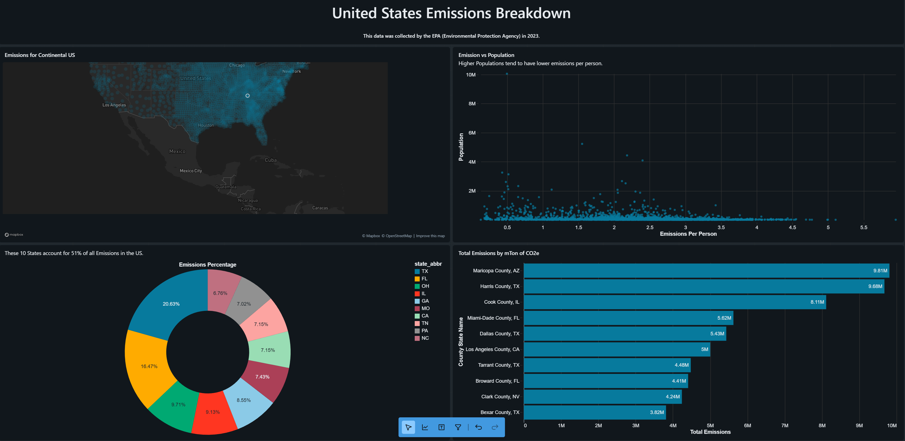

# 📊 End-to-End Data Engineering Project with Databricks

## 📌 Introduction
This project demonstrates the design and implementation of a complete **end-to-end data pipeline** using Databricks. The goal is to simulate a real-world data workflow by ingesting raw data, transforming it into structured formats, and generating meaningful insights through analytics and visualization.

---

## 📖 Project Overview
In this project, I built a scalable data pipeline that processes a **U.S. emissions dataset**, transforming raw data into actionable insights.

---

## 🖼️ Dashboard Preview

---

## 🛠️ Tools & Technologies Used
- Databricks  
- SQL  

---

## 🔄 Workflow Stages

### 1. Data Ingestion
- Imported raw dataset into Databricks  
- Stored data for structured processing  

### 2. Data Transformation
- Cleaned and transformed data using SQL  
- Handled missing and inconsistent values  
- Prepared datasets for analysis  

### 3. Data Storage
- Organized data into structured tables for analysis  

### 4. Data Analysis & Visualization
- Performed exploratory data analysis (EDA)  
- Built queries for insights  
- Developed an interactive dashboard  

---

## 📊 Key Insights
- A small number of states contribute to a **large percentage of total emissions (~51%)**
- Counties like **Maricopa County, AZ** and **Harris County, TX** are among the highest emitters
- Higher population does **not always correlate** with higher emissions per person
- Emissions distribution shows **regional concentration patterns across the U.S.**

---

## 📈 What I Learned
- Building **end-to-end data workflows**  
- Writing efficient **SQL queries for data transformation**  
- Structuring datasets for analysis  
- Turning raw data into **actionable insights**  
- Creating **data visualizations and dashboards**  

---

## ⚠️ Challenges Faced
- Cleaning and structuring raw data  
- Writing optimized SQL queries  
- Ensing data consistency across transformations  
- Interpreting data for meaningful insights  

---

## 🚀 Future Improvements
- Automate workflows using scheduling tools  
- Integrate additional datasets for deeper analysis  
- Improve dashboard interactivity  
- Expand analysis with more advanced queries  

---

## ⭐ How to Use
1. Clone the repository  
2. Upload dataset into Databricks  
3. Run SQL queries  
4. Explore dashboard insights

--- 

## 🎯 Conclusion
This project demonstrates the ability to build a **data pipeline using SQL within Databricks**, transforming raw data into meaningful insights and visualizations.

---

## 🙏 Credits
Inspired by a YouTube tutorial on building an end-to-end data project using Databricks https://www.youtube.com/watch?v=CoqZTt528ew
